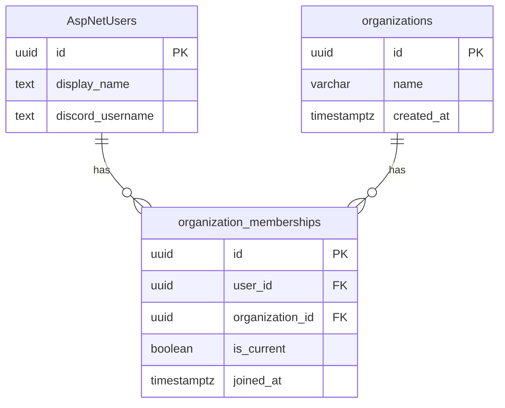

# Phase 1 Data Model: Organization Foundation & Admin Assignment

**Feature**: 021-org-foundation | **Date**: 2026-07-19

Conventions followed from the existing codebase: `Guid` primary keys assigned client-side, snake_case
columns via `EFCore.NamingConventions` *and* explicit `HasColumnName`, `ux_`/`ix_`/`fk_` index and
constraint naming, `IEntityTypeConfiguration<T>` classes under `Persistence/Configurations/`, no
navigation properties (bare `Guid` foreign keys), default schema `public`.

---

## Entities

### `Organization`

`backend/src/NajaEcho.Domain/Organizations/Organization.cs`

```csharp
public sealed class Organization
{
    public Guid Id { get; set; }
    public string Name { get; set; } = string.Empty;
    public DateTimeOffset CreatedAt { get; set; }
}
```

| Property | Column | Type | Constraints |
|---|---|---|---|
| `Id` | `id` | `uuid` | PK |
| `Name` | `name` | `varchar(100)` | required |
| `CreatedAt` | `created_at` | `timestamptz` | required |

Table: `public.organizations`

**Name is not unique** (spec Assumptions) — only one organization exists and no creation path can
produce a second, so a uniqueness constraint would encode a rule the product does not enforce.

---

### `OrganizationMembership`

`backend/src/NajaEcho.Domain/Organizations/OrganizationMembership.cs`

```csharp
public sealed class OrganizationMembership
{
    public Guid Id { get; set; }
    public Guid UserId { get; set; }
    public Guid OrganizationId { get; set; }
    public bool IsCurrent { get; set; }
    public DateTimeOffset JoinedAt { get; set; }
}
```

| Property | Column | Type | Constraints |
|---|---|---|---|
| `Id` | `id` | `uuid` | PK |
| `UserId` | `user_id` | `uuid` | FK → `"AspNetUsers".id`, cascade delete |
| `OrganizationId` | `organization_id` | `uuid` | FK → `organizations.id`, restrict delete |
| `IsCurrent` | `is_current` | `boolean` | required, default `false` |
| `JoinedAt` | `joined_at` | `timestamptz` | required |

Table: `public.organization_memberships`

**Indexes** — both carry real invariants:

```sql
-- FR-004: at most one current membership per user. Partial index makes two
-- current rows physically unrepresentable, including under concurrent writes.
CREATE UNIQUE INDEX ux_organization_memberships_user_current
  ON organization_memberships (user_id) WHERE is_current;

-- A user holds at most one membership row per organization. Re-assigning to an
-- organization the user already belongs to marks the existing row current
-- rather than inserting a duplicate.
CREATE UNIQUE INDEX ux_organization_memberships_user_org
  ON organization_memberships (user_id, organization_id);
```

EF configuration:

```csharp
builder.HasIndex(m => m.UserId)
       .IsUnique()
       .HasFilter("is_current")
       .HasDatabaseName("ux_organization_memberships_user_current");

builder.HasIndex(m => new { m.UserId, m.OrganizationId })
       .IsUnique()
       .HasDatabaseName("ux_organization_memberships_user_org");

builder.HasOne<Organization>()
       .WithMany()
       .HasForeignKey(m => m.OrganizationId)
       .HasConstraintName("fk_organization_memberships_organization_id")
       .OnDelete(DeleteBehavior.Restrict);
```

`OnDelete(Restrict)` on the organization FK: deleting an organization with members is out of scope,
and the database should refuse rather than silently orphan or cascade.

The user FK targets the Identity table and must be declared against `ApplicationUser` (Infrastructure)
with cascade delete, so removing a user removes their memberships.

---

### `IOrganizationScoped` (marker)

`backend/src/NajaEcho.Domain/Organizations/IOrganizationScoped.cs`

```csharp
public interface IOrganizationScoped
{
    Guid OrganizationId { get; set; }
}
```

**No entity implements this in this feature.** It is the contract #32/#33/#34 opt into. References
only `System.Guid`, so Domain acquires no framework dependency.

---

### `DefaultOrganization` (constants)

`backend/src/NajaEcho.Domain/Organizations/DefaultOrganization.cs`

```csharp
public static class DefaultOrganization
{
    public static readonly Guid Id = new("9b8ac811-3cec-421c-8cfb-cc56f775ad5a");
    public const string Name = "Naja Echo";
}
```

A fixed id makes the migration guard trivial and gives tests a stable value to assert against (D7).
This exact literal must also appear in the migration SQL below — the two are a matched pair, and a
mismatch would create a second organization on every deploy while leaving the constant pointing at
a row that does not exist.

---

## Relationships



A user's effective organization is the `organization_id` of their membership row where
`is_current = true`, or none.

---

## State transitions

Membership currency is the only mutable state.

| From | Action | To | Notes |
|---|---|---|---|
| No membership | Admin assigns to org X | One row, `is_current = true` | Insert |
| Current in X | Admin assigns to org Y | X row `is_current = false`, Y row `is_current = true` | Both in one transaction; Y row inserted or reactivated |
| Current in X | Admin assigns to X | unchanged | Idempotent; existing row stays current |
| Current in X | Admin clears | X row `is_current = false` | Row is retained, not deleted — preserves membership history for later multi-membership |
| Not current in X | Admin assigns to X | X row `is_current = true` | Reactivates the existing row (satisfies `ux_…_user_org`) |

Clearing retains the row rather than deleting it. FR-016 says a reassigned member's records stay with
the organization they were created in; keeping the membership row means a later "restore" is a flag
flip, and the join table accumulates the history Epic #30 wants for multi-membership.

**Ordering matters**: the clear must happen before the set within the transaction, or the partial
unique index rejects the write.

---

## Migration: `AddOrganizations`

`backend/src/NajaEcho.Infrastructure/Persistence/Migrations/*_AddOrganizations.cs`

Four steps in `Up`:

1. **Create `organizations`** — `id`, `name`, `created_at`; PK `pk_organizations`.
2. **Create `organization_memberships`** — columns above, PK, both unique indexes, both FKs.
3. **Seed the default organization**, guarded for idempotency (FR-009):

   ```sql
   INSERT INTO organizations (id, name, created_at)
   VALUES ('<DefaultOrganization.Id>', 'Naja Echo', NOW())
   ON CONFLICT (id) DO NOTHING;
   ```

4. **Backfill memberships** for every existing user (FR-008), also guarded:

   ```sql
   INSERT INTO organization_memberships (id, user_id, organization_id, is_current, joined_at)
   SELECT gen_random_uuid(), u.id, '<DefaultOrganization.Id>', true, NOW()
   FROM "AspNetUsers" u
   WHERE NOT EXISTS (
       SELECT 1 FROM organization_memberships m WHERE m.user_id = u.id
   );
   ```

   `"AspNetUsers"` must be quoted — Identity tables kept PascalCase names when the snake_case
   convention was introduced. `gen_random_uuid()` is built in from Postgres 13; no extension needed.

`Down` drops both tables. No data outside these tables is touched, so `Down` is non-destructive to
pre-existing data — this is **not** a destructive migration under the constitution's Development
Workflow rule and needs no special approval.

**Verification queries** (also used by `quickstart.md`):

```sql
SELECT count(*) FROM organizations;                              -- expect 1
SELECT count(*) FROM "AspNetUsers";                              -- expect N
SELECT count(*) FROM organization_memberships WHERE is_current;  -- expect N
```

---

## Query filter wiring

`backend/src/NajaEcho.Infrastructure/Persistence/OrganizationScopeExtensions.cs`

```csharp
public static void ApplyOrganizationFilters(
    this ModelBuilder modelBuilder,
    Expression<Func<Guid?>> currentOrganizationAccessor)
```

Walks `modelBuilder.Model.GetEntityTypes()`, selects those whose `ClrType` implements
`IOrganizationScoped`, and applies `HasQueryFilter` with an expression equivalent to:

```csharp
e => e.OrganizationId == currentOrganizationId
```

**Critical constraint**: the expression must reference a *DbContext instance member*, not a captured
local. EF Core parameterizes instance-member access in query filters, so the compiled model stays
cacheable while the value varies per request. Capturing the value at model-build time bakes the first
request's organization into the cached model — the classic multi-tenancy bug, and the specific
failure D5's integration test exists to catch.

`AppDbContext` therefore gains:

```csharp
public sealed class AppDbContext(
    DbContextOptions<AppDbContext> options,
    IOrganizationContext organizationContext)
    : IdentityDbContext<ApplicationUser, IdentityRole<Guid>, Guid>(options)
{
    public Guid? CurrentOrganizationId => organizationContext.CurrentOrganizationId;

    public DbSet<Organization> Organizations => Set<Organization>();
    public DbSet<OrganizationMembership> OrganizationMemberships => Set<OrganizationMembership>();

    protected override void OnModelCreating(ModelBuilder modelBuilder)
    {
        // ... existing base call, HasDefaultSchema, 23 ApplyConfiguration calls ...
        modelBuilder.ApplyConfiguration(new OrganizationConfiguration());
        modelBuilder.ApplyConfiguration(new OrganizationMembershipConfiguration());

        modelBuilder.ApplyOrganizationFilters(() => CurrentOrganizationId);
    }
}
```

**Unassigned users**: `CurrentOrganizationId` is `null`, and `e.OrganizationId == null` is never true
for a non-nullable column — so the filter returns empty rather than erroring (FR-021).

**DI impact**: `AppDbContext` gains a constructor parameter, so `IOrganizationContext` must be
registered before it. The `PostgresFixture.CreateContext()` helper constructs `AppDbContext` directly
and must pass a stub context — see quickstart.

---

## What this model does *not* do

- No `organization_id` column is added to `warehouse_inventory`, `warehouse_material_inventory`,
  `hangar_entries`, `loot_ledger`, or `loot_member_standings`. Those belong to #32/#33/#34.
- No entity implements `IOrganizationScoped` yet.
- No reference/catalog table in the `sc` schema is touched (FR-019).
- No organization column is added to `ApplicationUser` (D1) — this is a deliberate departure from
  issue #31's original wording.
